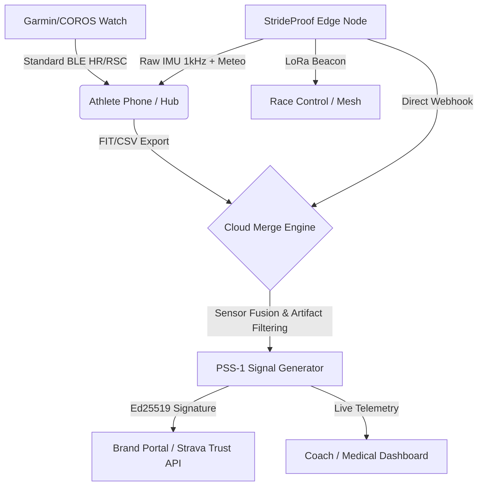

# StrideProof Protocol (PSS-1)

**Cryptographic Proof-of-Activity & Anti-Spoofing Middleware for Sports Ecosystems**

StrideProof is an edge-computing standard designed to eliminate GPS and biometric spoofing in fitness leaderboards, corporate challenges, and reward campaigns.

## 🛡️ The Problem
Up to 30% of submissions in open GPS-based reward campaigns are vulnerable to spoofing (emulators, GPS drift manipulation, vehicle-assisted runs). Traditional server-side validation cannot distinguish between a real human and a manipulated API payload.

## ⚙️ The Solution: PSS-1 (Proof-of-Stride Signal v1.0)
StrideProof shifts the trust layer to the edge. By correlating multi-sensor telemetry and cryptographically signing the payload at the device level, we guarantee **Proof-of-Humanity** and **Proof-of-Location**.

### Core Architecture
1. **Edge Ingestion:** Raw telemetry from wearable sensors (IMU, PPG, Barometer).
2. **Sensor Fusion & Anomaly Detection:** On-device filtering of mechanical artifacts.
3. **Cryptographic Signing:** Payload is hashed and signed using **Ed25519**.
4. **Zero-Knowledge Privacy Layer:** GPS coordinates are anonymized/hashed before transmission (GDPR/CCPA compliant).
5. **Webhook Delivery:** Signed JSON payloads are pushed to Brand Portals or Ecosystem APIs (Strava, Garmin Connect, COROS).

### 🏗️ System Architecture (Dual-Track Ingestion)
StrideProof does not replace existing hardware. It acts as a cryptographic middleware layer.


* **Track A (UX):** Standard BLE profiles ensure zero-friction pairing with existing watches.
* **Track B (Truth):** Raw telemetry is fused, scored, and cryptographically signed before reaching the Brand Portal.

## 📊 Signal Payload Structure (Example)
```json
{
  "protocol": "PSS-1",
  "version": "1.0",
  "timestamp_utc": "2026-10-07T15:00:00Z",
  "node_pubkey": "ed25519:7a9b...",
  "activity": {
    "type": "running",
    "duration_sec": 3600,
    "distance_m": 10000
  },
  "biometrics": {
    "avg_hr": 155,
    "cadence_spm": 178,
    "human_verified": true
  },
  "proof": {
    "signature_ed25519": "3f8a9c...",
    "quality_score": 94
  }
}
```

## 🤝 Integration
StrideProof is designed to act as a middleware or a standard BLE GATT peripheral (Heart Rate / Running Speed and Cadence profiles) to seamlessly integrate with existing ecosystems like Garmin Connect IQ, Strava API, and COROS.

---
**Status:** MVP / Active B2B Pilots
**Contact:** strideproof.partners@gmail.com
**Documentation:** [Live One-Pager](https://stepurinaleksei64-byte.github.io/strideproof/one-pager.html)

---
> 🛡️ [Read our Technical Brief: Eliminating Spoofing on Strava Leaderboards](STRAVA_ANTI_SPOOF.md)
